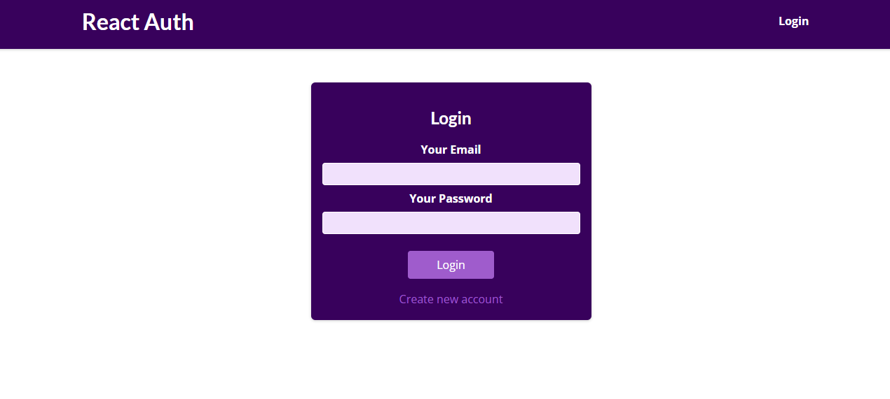
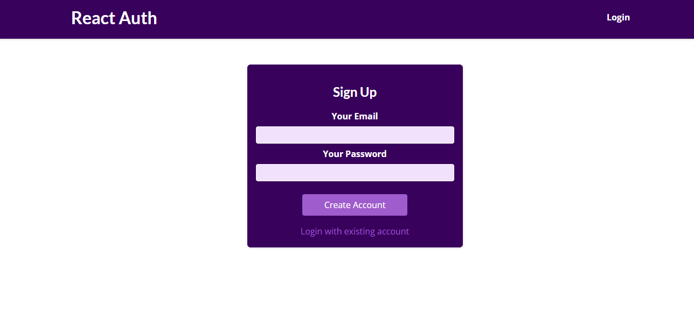
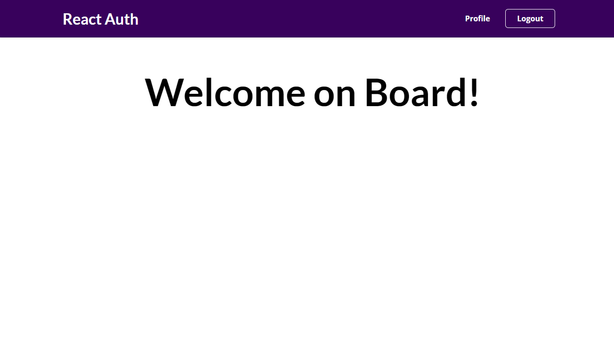
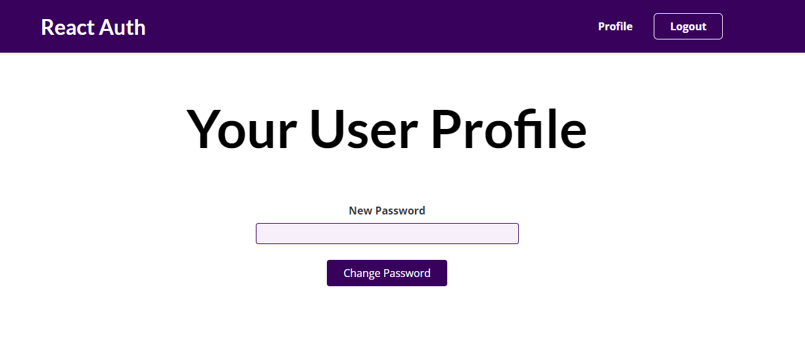

# Admin App Assignment

I build an admin app which as my final app for graduation from React course with GSG

## Details:
1. this app will have a login page as shown below 

2. when user click on create new account the same page will be exist and the labels will change as bellow

3. the nav bar as shown above will contain one tab named login, if the user make a login a new tab named profile will be shown and the login should be changed to logout as shown bellow 

4. the profile tab will contain a new form that make the user to change the password of the logged in user

 

## API Specs 

the api that was used is [Google Firebase](https://console.firebase.google.com/) 

THe used APIs are:
    - [sign in docs](https://firebase.google.com/docs/reference/rest/auth?hl=en&authuser=0#section-sign-in-email-password)
    - [sign up docs](https://firebase.google.com/docs/reference/rest/auth?hl=en&authuser=0#section-create-email-password)
    - [reset password docs](https://firebase.google.com/docs/reference/rest/auth?hl=en&authuser=0#section-change-password)

